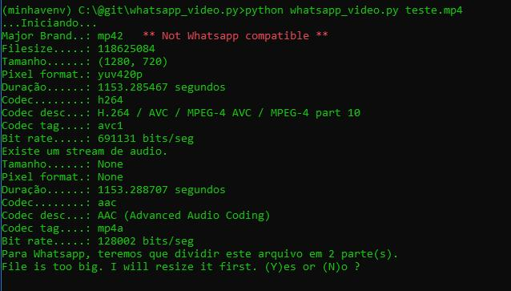
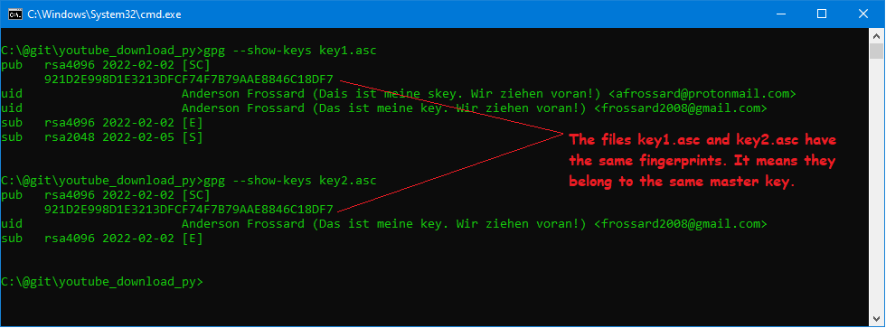

<h1 align="center">Karoua Whatsapp Converter</h1>

Convert Videos to Whatsapp format

Table of contents
===============
<!--ts-->

- [About](#about)
- [Features](#features)
- [Instalation and how to use](#instalation-and-how-to-use)
	- [Requirements](#requirements)
	
	- [GUI - Graphical User Interface](#gui)
	
	- [Command-line interface](#cli)
	
	- [Windows Standalone](#standalone)
-	[Public key](#public-key)
-	[Tecnologies](#tecnologies)
- [Autor](#autor)
<!--te-->

## About

Hi.

Have you ever failed to send a video through Whatsapp ? Sometimes the app can´t create a window preview image or perhaps the file is too big?
    Well, my software will make it fit, whether by converting or spliting into n parts.

My software is straight to the point:

<ul>
  <li>Insert filename in command line</li>
  <li>Answer (Y)es or (N)o</li>
  <li>Voilá!</li>
</ul>      

## Features
- [ ] Gui Interface
- [x] Video resize if resolution is too big
- [x] Split into n files if filesize is too big

## Instalation-and-how-to-use

### Requirements

>colorama
>ffmpy
>ffprobe
>future

You can install it by running this command:

	pip install pytube
	pip install colorama
	pip install ffmpy
	pip install ffprobe-python

## CLI - Command Line Interface

<h2>Running with CLI :</h2>

	python whatsapp_video.py file-to-convert.avi

## Standalone
## Standalone executable for Windows:

Perhaps you just want a fast way to get things running. The standalone executable will suit you well.
<ul>
	<li>Download the zip file</li>
	<li>Unzip the zip file into a new folder</li>
	<li>Check  integrity of zip file's content (optional)</li>
	<li>Open terminal and execute: whatsapp_video.exe filename-to-convert.avi </li>
</ul>

### How to check whether the zipfile has not been tampered with:

First, you need to download my pgp public key and check if my public key has not been hacked or tampered with. In order to do that, you should download my public pgp key from two different sources.
They must have the same fingerprint and must not have been revoked.

[Check my Fingerprint here](#fingerprint)

### How to obtain my Public keys

[Public key](#public-key)

### How to check if the keys are correct and valid:

 Run this command to check fingerprint from diferent files:

	gpg --show-keys filename1.asc

 

 If they both have my [fingerprint](#fingerprint) and have not been revoked, good, the key is valid and secure for use. 

Import my pgp public signature key:

	gpg --import frossard.public.key.asc

Check wether youtube_download.zip has been signed by myself:

	gpg --verify youtube_download.sig

To pass verification you should see a message saying
>Good signature from Anderson Frossard. (Das ist meine key. Wir ziehen voran!)

gpg will probably also say this signature is not certified. That´s because you have just downloaded it and have not applied command *trust* to it.

Once the gpg has verified the  file has been signed by myself, you are safe to unzip it and run its executable. 

Optionally, for aditional security you can hash your youtube_download.exe file and compare with my hash:

<table>
	<tr>
		<td>SHA-256</td>
		<td>File</td>
	<tr>
		<td>Yet do be hashed</td>
		<td>whatsapp_video.exe</td>
	</tr>
</table>

The hashes must be exactly the same. 

## Public-key

My PGP public key is avaiable at:

[Public Key at Github](https://github.com/AndersonFrossard/karoua_youtube_download_gui/tree/main/standalone/frossard_public_key.asc)

[PGP Global Directory](https://keyserver2.pgp.com/vkd/DownloadKey.event?keyid=0xB79AAE8846C18DF7)

### Fingerprint
My PGP public key full fingerprint is:

	921D 2E99 8D1E 3213 DFCF 74F7 B79A AE88 46C1 8DF7

My PGP public key fingerprint key ID is:

	46C1 8DF7

Enjoy!

## Tecnologies

Solely written in Python 3.8.7. 
Libraries imported:
<ul>
<li>colorama</li>
<li>ffmpy</li>
<li>ffprobe-python</li>
<li>future</li>
</ul>
 

### Autor
---

 
 ✈️ ::statue_of_liberty::

<a href="https://github.com/AndersonFrossard" title="GitHub">

 <b> Anderson Frossard</b></a>

 
Done with ❤️ by Anderson Frossard 👋🏽 Get in contact!  

